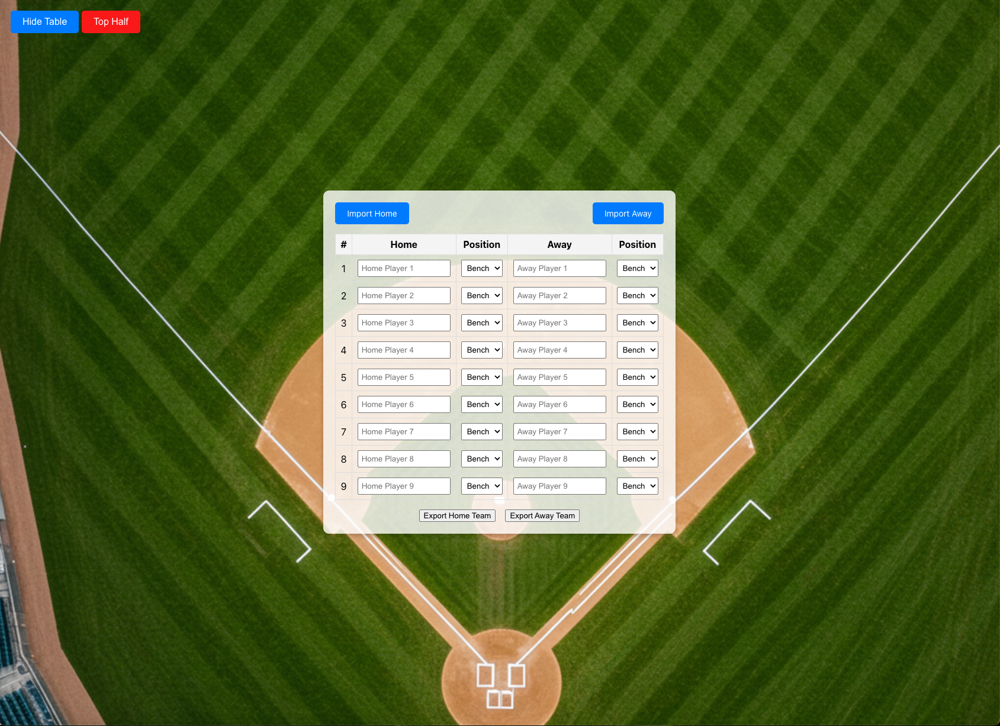

# Baseball Announcer's Assistant

### [Live App](https://manheima.github.io/Baseball-Announcer-s-Assistant)

This is a React-based application designed to assist baseball announcers in managing team lineups, positions, and game details. The app allows users to import/export team data, manage player positions, and toggle between game states.

## Features

- Import team data (Home and Away) from CSV files.
- Export team data (Home and Away) to CSV files.
- Manage player positions and batting order.
- Toggle between top and bottom innings.
- Show or hide the game table for better focus.
